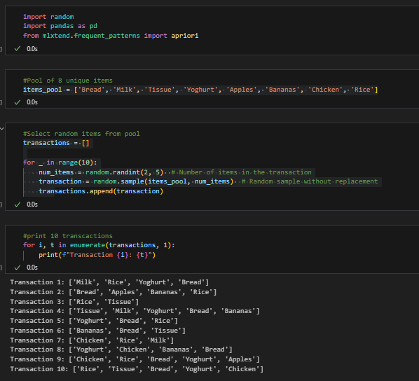
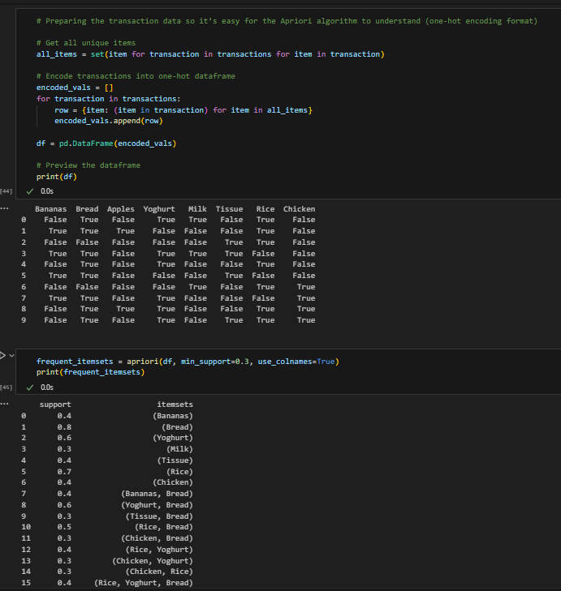
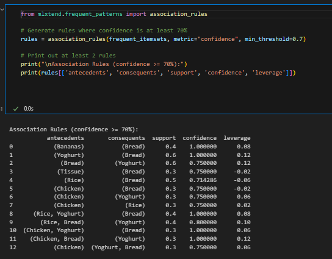

# Kyra-association-mini

A mini project on association rule mining with simulated data.

---

## Objective 1: Simulate Transaction Data
We created 10 fake transactions using Python. Each transaction contains 2 to 5 randomly selected items from this pool:
- Bread
- Milk
- Tissue
- Yoghurt
- Apples
- Bananas
- Chicken
- Rice



---

## Objective 2: Analyze with Apriori
The transaction data was converted into a one-hot encoded format using `pandas` so it could be used by the Apriori algorithm.  
We applied the Apriori algorithm with a minimum support threshold of 30% to find frequent itemsets.



---

## Objective 3: Generate Association Rules
We generated association rules with:
- Metric: confidence
- Minimum threshold: 70%

We displayed at least two rules and included the leverage metric to understand how much more often the itemsets occur together than would be expected by chance.

Example explanation for one rule:
> When customers buy Bananas, they also buy Bread 100% of the time in this dataset. This suggests Bananas and Bread are often purchased together and could be promoted as a combo.



---

## Requirements
The following libraries were used:
- `pandas`
- `mlxtend`

---

## How to run:
1. Install dependencies:
    ```
    pip install pandas mlxtend
    ```

2. Open and run `association_rule_mining.ipynb` step by step.

